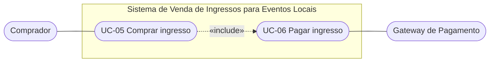

# Diagrama de Casos de Uso

```mermaid
flowchart LR
    Comprador(["Comprador"])
    Gateway(["Gateway de Pagamento"])

    subgraph Sistema["Sistema de Venda de Ingressos para Eventos Locais"]
        UC05([UC-05 Comprar ingresso])
        UC06([UC-06 Pagar ingresso])
    end

    Comprador --- UC05
    UC05 -. "«include»" .-> UC06
    UC06 --- Gateway
```

**Relacionamento:** «include» de UC-05 (Comprar ingresso) para UC-06 (Pagar ingresso), pois toda compra exige pagamento.
