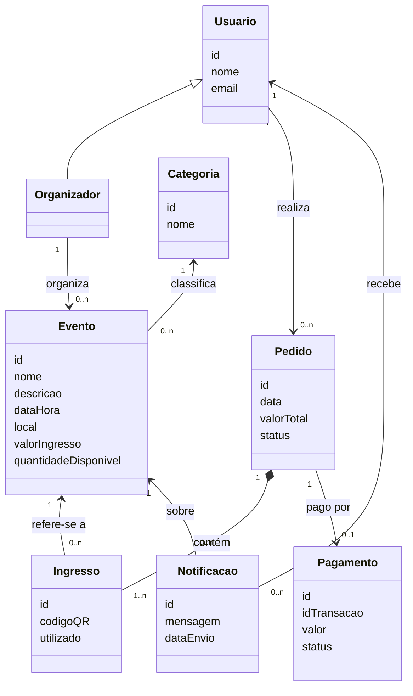

# Diagrama de Classes do Domínio

```mermaid
classDiagram
    class Usuario {
        id
        nome
        email
    }
    class Organizador
    class Categoria {
        id
        nome
    }
    class Evento {
        id
        nome
        descricao
        dataHora
        local
        valorIngresso
        quantidadeDisponivel
    }
    class Pedido {
        id
        data
        valorTotal
        status
    }
    class Ingresso {
        id
        codigoQR
        utilizado
    }
    class Pagamento {
        id
        idTransacao
        valor
        status
    }
    class Notificacao {
        id
        mensagem
        dataEnvio
    }

    Usuario <|-- Organizador
    Organizador "1" --> "0..n" Evento : organiza
    Categoria "1" <-- "0..n" Evento : classifica
    Usuario "1" --> "0..n" Pedido : realiza
    Pedido "1" *-- "1..n" Ingresso : contém
    Evento "1" <-- "0..n" Ingresso : refere-se a
    Pedido "1" --> "0..1" Pagamento : pago por
    Usuario "1" <-- "0..n" Notificacao : recebe
    Evento "1" <-- "0..n" Notificacao : sobre
```